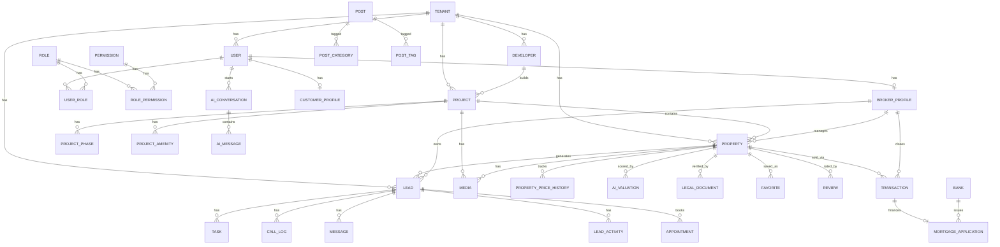

# ER Diagram (Core Domain)

This is a simplified view of the 47-model schema, showing the core relationships.
Full detail lives in `packages/db/prisma/schema.prisma`.

## Notes
- All tenant-scoped entities include `tenantId` for multi-tenancy isolation (enforced at the query/service layer, not shown in the diagram for clarity).
- `Embedding` (vector store for RAG) is intentionally decoupled from any single entity via `sourceType` + `sourceId` so it can index Property, Project, Post, or FAQ content uniformly.
- `AuditLog` and `PageView` are append-only and not tied to foreign-key cascades, so they survive entity deletion for compliance history.
